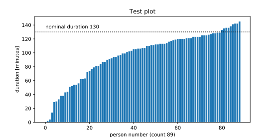

<!-- Time-stamp: <2020-05-16 07:50:35>                                      -->
<!-- Purpose   : zoompart.py readme                                         -->
<!-- Author    : Robbie Morrison <robbie.morrison@posteo.de>                -->
<!-- Project   : zoomcsv                                                    -->
<!-- Commenced : 19-Apr-2020                                                -->
<!-- Status    : work-in-progress                                           -->
<!-- Editor    : ReText 7.0.4 / Ubuntu 19.04                                -->
<!-- Keywords  : zoom                                                       -->
<!-- Notes     :                                                            -->

# zoompart.py

Plot Zoom video‑meeting participant duration information.

### Overview

This one file utility takes the participant CSV file, processes it a little, and produces a bar graph showing the participation rates.  In particular:

- the utility deduplicates multiple sessions by the same user to produce a single session
- the gaps and overlaps in multiple sessions are accounted for by default
- deduplication examines email addresses by default or optionally user names &mdash; users often enter slightly different names between sessions and names are therefore less reliable in this regard
- the utility tallies the number of sessions above a certain user‑defined time threshold to report the number of engaged users
- the widely disliked "Attentiveness Score" metric is no longer present in the participant CSV file by default and is therefore not considered

Multiple sessions by the same user are quite common and often overlap.

### Getting started

A typical call might comprise:

```
$ zoompart.py \
  --verbose \
  --dat-file \
  --nominal-duration=130 \
  --cutoff=20 \
  --title="Test plot" \
  participants_123456789.csv
```

To yield to following plot:



No personal data is embedded in either the produced SVG or DAT files.  The DAT file contains only the raw numbers used to create the bar graph.

There is not real need to clone this repository, just download or copy‑paste the contents of `zoompart.py` to a local file, set the [execute permission](https://en.wikipedia.org/wiki/Chmod), and run that:

```
$ chmod u+x zoompart.py
$ ./zoompart.py --help
```

The various function definitions in the utility could be pulled out and used to drive an interactive [jupyter notebooks](https://en.wikipedia.org/wiki/Project_Jupyter#Jupyter_Notebook) session instead.

As of April&nbsp;2020, Zoom names the participant file using the following convention:

- `participants_<meeting-ID-without-dashes>.csv`

### Software license

The software license is [ISC](https://spdx.org/licenses/ISC.html), regarded as equivalent to the [MIT](https://spdx.org/licenses/MIT.html) permissive license but with simpler wording.

### Options

The following options are provided:

| long                 | short | argument | comment                                        |
|----------------------|------:|---------:|------------------------------------------------|
| `--version`          |  `-V` |  &mdash; | show utility version string and exit           |
| `--help`             |  `-h` |  &mdash; | show help message and exit                     |
| `--title`            |  `-t` |   string | specify plot title                             |
| `--numbered-title`   |  `-n` |  &#8469; | use custom numbered plot title                 |
| `--nominal-duration` |  `-l` |  &#8469; | set nominal meeting duration in minutes        |
| `--cutoff`           |  `-c` |  &#8469; | set short session threshold in minutes         |
| `--ignore-gaps`      |  `-I` |  &mdash; | consider only beginning and closing timestamps |
| `--dedup-name`       |  `-N` |  &mdash; | deduplicate on name not email address          |
| `--dat-file`         |  `-d` |  &mdash; | create or overwrite existing DAT file          |
| `--no-plot`          |  `-P` |  &mdash; | omit plot                                      |
| `--save-plot`        |  `-S` |  &mdash; | save plot automatically (system dependent)     |
| `--truncate`         |  `-T` |  &#8469; | truncate input data for testing purposes       |
| `--verbose`          |  `-v` |  &mdash; | show additional information                    |
| `--show-df`          |  `-D` |  &mdash; | show loaded dataframes                         |

&#8469; indicates {0, 1, 2, ...}.

The `--nominal-duration` option draws a horizontal dotted line annotated "nominal duration".  It is useful because sometimes participants continue to chat after the event proper has finished.

Users can adjust some hardcoded values in the script to better suit their needs.  See the comments in the code for further details.

### Requirements

The utility requires the following python dependencies:

- python3 &mdash; tested with version 3.6.2
- pandas
- matplotlib

### Status and caveats

The script is reasonably mature, although the following caveats apply:

- the utility has only been tested on Ubuntu 19.04 and it is possible some of the code is Linux‑specific
- you may need to modify the [hash‑bang line](https://en.wikipedia.org/wiki/Shebang_%28Unix%29) to suit your system
- you may need to adjust your `PATH` environment accordingly

<br>

&#9634;

<!-- end of file -->
